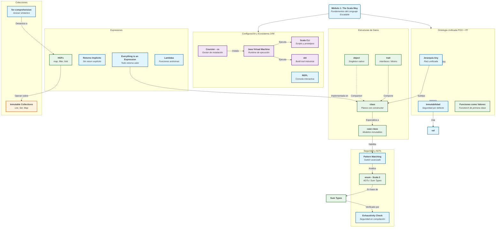

```mermaid
graph TD

    %% --- ESTILOS (CSS) ---
    classDef concept fill:#e1f5fe,stroke:#01579b,stroke-width:2px;
    classDef infra fill:#f3e5f5,stroke:#4a148c,stroke-width:2px;
    classDef code fill:#e8f5e9,stroke:#1b5e20,stroke-width:2px;
    classDef data fill:#fff3e0,stroke:#e65100,stroke-width:2px;

    %% --- NODO INICIAL ---
    Start("<b>Módulo 1: The Scala Way</b><br/><i>Fundamentos del Lenguaje Escalable</i>")

    %% --- SUBGRAFO 1: TOOLING ---
    subgraph Tooling [Configuración y Ecosistema JVM]
        JVM["<b>Java Virtual Machine</b><br/><i>Runtime de ejecución</i>"]
        %% He quitado los paréntesis problemáticos y puesto guiones
        Coursier["<b>Coursier - cs</b><br/><i>Gestor de instalación</i>"]
        ScalaCLI["<b>Scala CLI</b><br/><i>Scripts y prototipos</i>"]
        SBT["<b>sbt</b><br/><i>Build tool industrial</i>"]
        REPL["<b>REPL</b><br/><i>Consola interactiva</i>"]
    end

    %% --- SUBGRAFO 2: PARADIGMA ---
    subgraph Paradigma [Ontología Unificada POO + PF]
        Any["<b>Jerarquía Any</b><br/><i>Raíz unificada</i>"]
        Inmutabilidad["<b>Inmutabilidad</b><br/><i>Seguridad por defecto</i>"]
        FunctionsValue["<b>Funciones como Valores</b><br/><i>FunctionX de primera clase</i>"]
    end

    %% --- SUBGRAFO 3: MODELADO ---
    subgraph Modeling [Estructuras de Datos]
        Class["<b>class</b><br/><i>Planos con constructor</i>"]
        Object["<b>object</b><br/><i>Singleton nativo</i>"]
        Trait["<b>trait</b><br/><i>Interfaces / Mixins</i>"]
        CaseClass["<b>case class</b><br/><i>Modelos inmutables</i>"]
    end

    %% --- SUBGRAFO 4: LÓGICA ---
    subgraph Logic [Expresiones]
        Expr["<b>Everything is an Expression</b><br/><i>Todo retorna valor</i>"]
        ImplicitReturn["<b>Retorno Implícito</b><br/><i>Sin return explícito</i>"]
        HOFs["<b>HOFs</b><br/><i>map, filter, fold</i>"]
        Lambdas["<b>Lambdas</b><br/><i>Funciones anónimas</i>"]
    end

    %% --- SUBGRAFO 5: DATA ---
    subgraph Data [Colecciones]
        ImmutableColl["<b>Inmutable Collections</b><br/><i>List, Set, Map</i>"]
        ForComp["<b>for-comprehension</b><br/><i>Azúcar sintáctico</i>"]
    end

    %% --- SUBGRAFO 6: FLOW ---
    subgraph Flow [Seguridad y ADTs]
        PatternMatch["<b>Pattern Matching</b><br/><i>Switch avanzado</i>"]
        EnumADT["<b>enum - Scala 3</b><br/><i>ADTs / Sum Types</i>"]
        Exhaustivity["<b>Exhaustivity Check</b><br/><i>Seguridad en compilación</i>"]
    end

    %% --- CONEXIONES ---
    Start --> Tooling
    Start --> Paradigma

    %% Tooling
    Coursier -->|Instala| JVM
    JVM -->|Ejecuta| ScalaCLI
    JVM -->|Ejecuta| SBT

    %% Paradigma
    Paradigma -->|Impone| Inmutabilidad
    Inmutabilidad -->|Usa| valNode["<b>val</b>"]

    %% Modeling
    Paradigma -->|Define| Any
    Any -->|Subtipo| Class
    Class -->|Especializa a| CaseClass
    Trait -->|Compone| Class
    Object -.->|Companion| Class

    %% Logic
    CaseClass -->|Habilita| PatternMatch
    Expr -->|Implementada en| Class
    HOFs -->|Operan sobre| ImmutableColl
    ForComp -->|Desazúca a| HOFs

    %% Flow
    EnumADT -->|Es base de| SumTypes["<b>Sum Types</b>"]
    SumTypes -->|Verificado por| Exhaustivity
    PatternMatch -->|Analiza| EnumADT

    %% --- ASIGNACIÓN DE CLASES ---
    class Start,Any,Inmutabilidad,REPL,Expr,ImplicitReturn,Lambdas,ForComp,PatternMatch,Exhaustivity,valNode concept;
    class JVM,Coursier,ScalaCLI,SBT infra;
    class FunctionsValue,Class,Object,Trait,CaseClass,HOFs,EnumADT,SumTypes code;
    class ImmutableColl data;
```