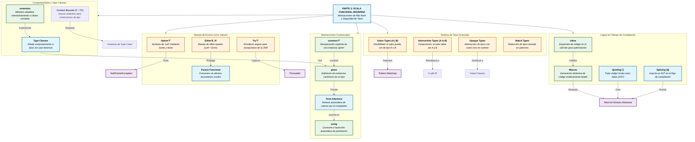

```mermaid
graph TD

%% Definición de Estilos Profesionales
classDef concept fill:#e1f5fe,stroke:#01579b,stroke-width:2px,color:#000;
classDef infra fill:#f3e5f5,stroke:#4a148c,stroke-width:2px,color:#000;
classDef code fill:#e8f5e9,stroke:#1b5e20,stroke-width:2px,color:#000;
classDef data fill:#fff3e0,stroke:#e65100,stroke-width:2px,color:#000;

%% Nodo Principal
M2["<b>PARTE 2: SCALA FUNCIONAL MODERNA</b><br/><i>Abstracciones de Alto Nivel y Seguridad de Tipos</i>"]

%% Subgrafo: Manejo de Ausencia y Errores Puros
subgraph Errores ["Manejo de Errores como Valores"]
    OptionT["<b>Option'T'</b><br/><i>Sustituto de 'null' mediante Some y None</i>"]
    EitherER["<b>Either'E, R'</b><br/><i>Manejo de fallos tipados (Left = Error)</i>"]
    TryT["<b>Try'T'</b><br/><i>Envoltorio seguro para excepciones de la JVM</i>"]
    Pura["<b>Pureza Funcional</b><br/><i>Funciones sin efectos secundarios ocultos</i>"]
end

%% Subgrafo: Abstracciones Contextuales (Scala 3)
subgraph Contexto ["Abstracciones Contextuales"]
    Given["<b>given</b><br/><i>Definición de instancias canónicas de un tipo</i>"]
    Using["<b>using</b><br/><i>Consumo e inyección automática de parámetros</i>"]
    Summon["<b>summon'T'</b><br/><i>Recuperación explícita de una instancia 'given'</i>"]
    TermInf["<b>Term Inference</b><br/><i>Síntesis automática de valores por el compilador</i>"]
end

%% Subgrafo: Type Classes y Extensión
subgraph Extensiones ["Comportamiento y Type Classes"]
    TypeClass["<b>Type Classes</b><br/><i>Añade comportamiento a tipos sin usar herencia</i>"]
    ExtMethods["<b>extension</b><br/><i>Métodos añadidos retroactivamente a clases cerradas</i>"]
    ContextBounds["<b>Context Bounds (T : TC)</b><br/><i>Azúcar sintáctico para restricciones de tipo</i>"]
end

%% Subgrafo: Tipos Avanzados de Scala 3
subgraph Tipos ["Sistema de Tipos Avanzado"]
    UnionT["<b>Union Types (A | B)</b><br/><i>Flexibilidad: el valor puede ser de tipo A o B</i>"]
    InterT["<b>Intersection Types (A & B)</b><br/><i>Composición: el valor debe ser A y B</i>"]
    OpaqueT["<b>Opaque Types</b><br/><i>Abstracción de tipos con coste cero en runtime</i>"]
    MatchT["<b>Match Types</b><br/><i>Reducción de tipos basada en patrones</i>"]
end

%% Subgrafo: Metaprogramación
subgraph Meta ["Lógica en Tiempo de Compilación"]
    Inline["<b>inline</b><br/><i>Expansión de código en el call-site para optimización</i>"]
    Macros["<b>Macros</b><br/><i>Generación dinámica de código estáticamente tipado</i>"]
    Quoting["<b>Quoting (')</b><br/><i>Trata código Scala como datos (AST)</i>"]
    Splicing["<b>Splicing ($)</b><br/><i>Inyecta un AST en el flujo de compilación</i>"]
end

%% Conexiones y Relaciones Técnicas
M2 --> Errores
M2 --> Contexto
M2 --> Extensiones
M2 --> Tipos
M2 --> Meta

OptionT -->|Evita| NPE["'NullPointerException'"]
EitherER -->|Propaga| Pura
TryT -->|Captura| Throwable["'Throwable'"]

Given -->|Provee| TermInf
TermInf -->|Inyecta en| Using
Summon -->|Localiza| Given

TypeClass -->|Usa| Given
ExtMethods -->|Implementa| TypeClass
ContextBounds -->|Requiere| TCInst["'Instancia de Type Class'"]

UnionT -->|Requiere| PM["'Pattern Matching'"]
OpaqueT -->|Sustituye a| ValueClasses["'Value Classes'"]
InterT -->|Reemplaza a| CompoundTypes["'A with B'"]

Inline -->|Habilita| Macros
Macros -->|Manipula| AST["'Árbol de Sintaxis Abstracta'"]
Quoting -->|Crea| AST
Splicing -->|Evalúa| AST

%% Asignación de Clases de Estilo
class M2 concept;
class OptionT,EitherER,TryT,UnionT,InterT,OpaqueT,MatchT data;
class Given,Using,Summon,ExtMethods,Inline,Macros code;
class Pura,TermInf,TypeClass,Quoting,Splicing concept;
class NPE,Throwable,AST,PM infra;
```