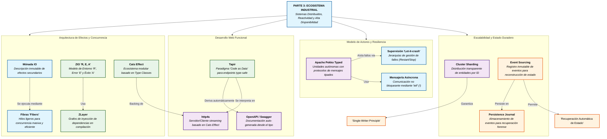

```mermaid
graph TD

%% Definición de Estilos Profesionales
classDef concept fill:#e1f5fe,stroke:#01579b,stroke-width:2px,color:#000;
classDef infra fill:#f3e5f5,stroke:#4a148c,stroke-width:2px,color:#000;
classDef code fill:#e8f5e9,stroke:#1b5e20,stroke-width:2px,color:#000;
classDef data fill:#fff3e0,stroke:#e65100,stroke-width:2px,color:#000;

%% Nodo Raíz
Industrial["<b>PARTE 3: ECOSISTEMA INDUSTRIAL</b><br/><i>Sistemas Distribuidos, Reactividad y Alta Disponibilidad</i>"]

%% Subgrafo: Programación de Efectos Puros
subgraph Efectos ["Arquitectura de Efectos y Concurrencia"]
    IOMonad["<b>Mónada IO</b><br/><i>Descripción inmutable de efectos secundarios</i>"]
    Fibers["<b>Fibras 'Fibers'</b><br/><i>Hilos ligeros para concurrencia masiva y eficiente</i>"]
    ZIOType["<b>ZIO 'R, E, A'</b><br/><i>Modelo de Entorno 'R', Error 'E' y Éxito 'A'</i>"]
    CatsEffect["<b>Cats Effect</b><br/><i>Ecosistema modular basado en Type Classes</i>"]
    ZLayer["<b>ZLayer</b><br/><i>Grafos de inyección de dependencias en compilación</i>"]
end

%% Subgrafo: Desarrollo Web Moderno
subgraph Web ["Desarrollo Web Funcional"]
    Tapir["<b>Tapir</b><br/><i>Paradigma 'Code as Data' para endpoints type-safe</i>"]
    Http4s["<b>http4s</b><br/><i>Servidor/Cliente streaming basado en Cats Effect</i>"]
    OpenAPI["<b>OpenAPI / Swagger</b><br/><i>Documentación auto-generada desde el tipo</i>"]
end

%% Subgrafo: Modelo de Actores (Pekko)
subgraph Actores ["Modelo de Actores y Resiliencia"]
    PekkoTyped["<b>Apache Pekko Typed</b><br/><i>Unidades autónomas con protocolos de mensajes tipados</i>"]
    Supervision["<b>Supervisión 'Let-it-crash'</b><br/><i>Jerarquías de gestión de fallos (Restart/Stop)</i>"]
    AsyncMsg["<b>Mensajería Asíncrona</b><br/><i>Comunicación no bloqueante mediante 'tell' (!)</i>"]
end

%% Subgrafo: Distribución y Persistencia
subgraph Persistencia ["Escalabilidad y Estado Duradero"]
    Sharding["<b>Cluster Sharding</b><br/><i>Distribución transparente de entidades por ID</i>"]
    EventSourcing["<b>Event Sourcing</b><br/><i>Registro inmutable de eventos para reconstrucción de estado</i>"]
    Journal["<b>Persistence Journal</b><br/><i>Almacenamiento de eventos para recuperación forense</i>"]
end

%% Conexiones y Relaciones Técnicas
Industrial --> Efectos
Industrial --> Web
Industrial --> Actores
Industrial --> Persistencia

IOMonad -->|Se ejecuta mediante| Fibers
ZIOType -->|Usa| ZLayer
CatsEffect -->|Backing de| Http4s

Tapir -->|Deriva automáticamente| OpenAPI
Tapir -->|Se interpreta en| Http4s

PekkoTyped -->|Aísla fallos via| Supervision
PekkoTyped -->|Usa| AsyncMsg

Sharding -->|Garantiza| SingleWriter["'Single-Writer Principle'"]
EventSourcing -->|Persiste en| Journal
EventSourcing -->|Permite| Recovery["'Recuperación Automática de Estado'"]

%% Asignación de Clases de Estilo
class Industrial,IOMonad,Fibers,Supervision,AsyncMsg concept;
class ZIOType,CatsEffect,ZLayer,Tapir code;
class PekkoTyped,Http4s,OpenAPI,Sharding infra;
class EventSourcing,Journal,Recovery,SingleWriter data;
```