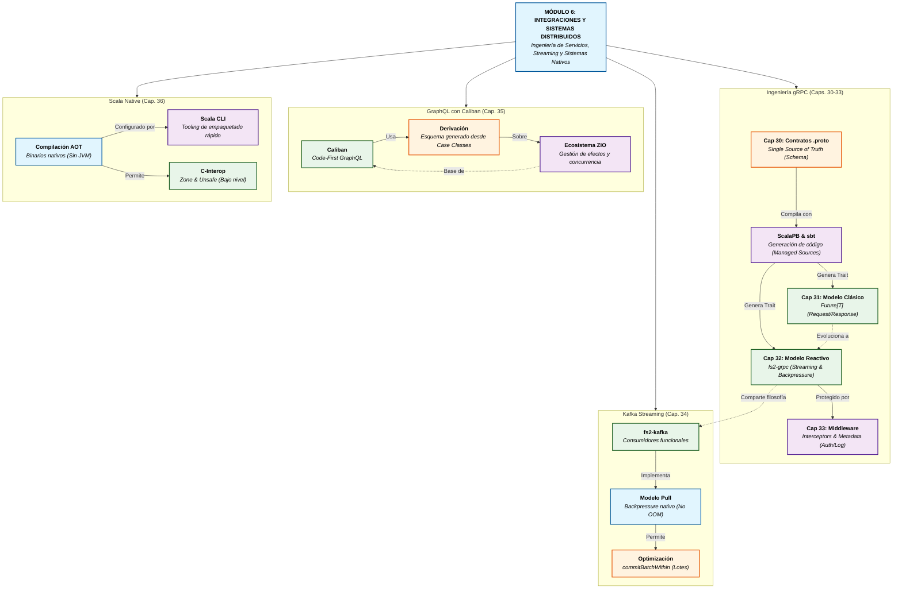

```mermaid
graph TD

%% ==========================================================================
%% DEFINICIÓN DE ESTILOS (Paleta Profesional)
%% ==========================================================================
classDef concept fill:#e1f5fe,stroke:#01579b,stroke-width:2px,color:#000;
classDef infra fill:#f3e5f5,stroke:#4a148c,stroke-width:2px,color:#000;
classDef code fill:#e8f5e9,stroke:#1b5e20,stroke-width:2px,color:#000;
classDef data fill:#fff3e0,stroke:#e65100,stroke-width:2px,color:#000;

%% ==========================================================================
%% NODO RAÍZ
%% ==========================================================================
M6["<b>MÓDULO 6: INTEGRACIONES Y SISTEMAS DISTRIBUIDOS</b><br/><i>Ingeniería de Servicios, Streaming y Sistemas Nativos</i>"]

%% ==========================================================================
%% SUBGRAFO 1: INGENIERÍA gRPC (Capítulos 30, 31, 32, 33)
%% ==========================================================================
subgraph GRPC ["Ingeniería gRPC (Caps. 30-33)"]
    direction TB
    
    %% Cap 30: Setup
    Proto["<b>Cap 30: Contratos .proto</b><br/><i>Single Source of Truth (Schema)</i>"]
    Build["<b>ScalaPB & sbt</b><br/><i>Generación de código (Managed Sources)</i>"]
    
    %% Cap 31: Base
    FutureImpl["<b>Cap 31: Modelo Clásico</b><br/><i>Future[T] (Request/Response)</i>"]
    
    %% Cap 32: Avanzado
    FS2Impl["<b>Cap 32: Modelo Reactivo</b><br/><i>fs2-grpc (Streaming & Backpressure)</i>"]
    
    %% Cap 33: Seguridad
    Sec["<b>Cap 33: Middleware</b><br/><i>Interceptors & Metadata (Auth/Log)</i>"]

    %% Flujo interno gRPC
    Proto -->|Compila con| Build
    Build -->|Genera Trait| FutureImpl
    Build -->|Genera Trait| FS2Impl
    FutureImpl -.->|Evoluciona a| FS2Impl
    FS2Impl -->|Protegido por| Sec
end

%% ==========================================================================
%% SUBGRAFO 2: KAFKA STREAMING (Capítulo 34)
%% ==========================================================================
subgraph Kafka ["Kafka Streaming (Cap. 34)"]
    FS2Kafka["<b>fs2-kafka</b><br/><i>Consumidores funcionales</i>"]
    PullModel["<b>Modelo Pull</b><br/><i>Backpressure nativo (No OOM)</i>"]
    CommitBatch["<b>Optimización</b><br/><i>commitBatchWithin (Lotes)</i>"]
end

%% ==========================================================================
%% SUBGRAFO 3: GRAPHQL (Capítulo 35)
%% ==========================================================================
subgraph GraphQL ["GraphQL con Caliban (Cap. 35)"]
    Caliban["<b>Caliban</b><br/><i>Code-First GraphQL</i>"]
    Derivation["<b>Derivación</b><br/><i>Esquema generado desde Case Classes</i>"]
    ZIOEnv["<b>Ecosistema ZIO</b><br/><i>Gestión de efectos y concurrencia</i>"]
end

%% ==========================================================================
%% SUBGRAFO 4: SCALA NATIVE (Capítulo 36)
%% ==========================================================================
subgraph Native ["Scala Native (Cap. 36)"]
    AOT["<b>Compilación AOT</b><br/><i>Binarios nativos (Sin JVM)</i>"]
    Interop["<b>C-Interop</b><br/><i>Zone & Unsafe (Bajo nivel)</i>"]
    CLI["<b>Scala CLI</b><br/><i>Tooling de empaquetado rápido</i>"]
end

%% ==========================================================================
%% CONEXIONES GLOBALES
%% ==========================================================================
M6 --> GRPC
M6 --> Kafka
M6 --> GraphQL
M6 --> Native

%% Relaciones Inter-módulos (Opcional, para contexto)
FS2Impl -.->|Comparte filosofía| FS2Kafka
ZIOEnv -.->|Base de| Caliban

%% Conexiones internas específicas
FS2Kafka -->|Implementa| PullModel
PullModel -->|Permite| CommitBatch

Caliban -->|Usa| Derivation
Derivation -->|Sobre| ZIOEnv

AOT -->|Configurado por| CLI
AOT -->|Permite| Interop

%% ==========================================================================
%% ASIGNACIÓN DE ESTILOS
%% ==========================================================================
class M6,Proto,PullModel,AOT concept;
class Build,Sec,CLI,ZIOEnv infra;
class FutureImpl,FS2Impl,FS2Kafka,Caliban,Interop code;
class Derivation,CommitBatch,Proto data;
```