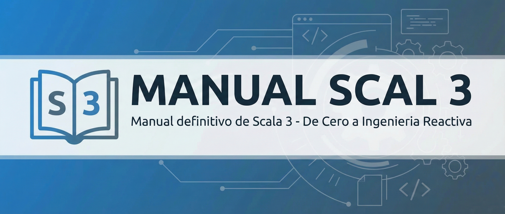

<p align="center">
  
</p>

<p align="center">
  <a href="https://www.scala-lang.org/"></a>
  <a href="./LICENSE"></a>
  
</p>

## Descripcion

Este repositorio contiene un manual exhaustivo de Scala 3, disenado para transicionar desarrolladores con experiencia en Java o Python hacia el ecosistema profesional de Scala. El contenido abarca desde los fundamentos del lenguaje hasta arquitecturas reactivas, Big Data con Apache Spark, y sistemas de efectos como Cats Effect y ZIO.

### Caracteristicas

- **100% Scala 3 Nativo**: Sintaxis moderna sin codigo legacy de Scala 2.
- **Enfoque Industrial**: Cobertura de Apache Pekko, Apache Spark, Cats Effect, ZIO y Doobie.
- **Comparativas Practicas**: Cada capitulo incluye comparaciones directas entre Java, Python y Scala.
- **Ejemplos Realistas**: Codigo ejecutable orientado a casos de uso profesionales.

---

## Acceso Rapido

| Recurso | Descripcion |
|---------|-------------|
| [Guia Rapida (Cheatsheet)](./CHEATSHEET%20-%20Guia%20rapida.md) | Referencia condensada de sintaxis y patrones |
| [Indice General](./INDICE.md) | Vista secuencial de todos los capitulos |
| [Infografia](./Infografía_scala.png) | Diagrama visual del ecosistema Scala |

---

## Tabla de Contenidos

### Introduccion

| Documento | Descripcion |
|-----------|-------------|
| [Desmitificando la Programacion Funcional](./00%20-%20Introduccion/00%20-%20Desmitificando%20la%20Programación%20Funcional%20en%20Scala%20-%20Una%20Guía%20para%20Principiantes.md) | Los pilares fundamentales de la PF en Scala |
| [Los Pilares Conceptuales de Scala](./00%20-%20Introduccion/00%20-%20Los%20Pilares%20Conceptuales%20de%20Scala%20-%20El%20Paradigma%20Híbrido.md) | Ontologia unificada POO + Programacion Funcional |
| [Guia de Transicion: Java/Python a Scala 3](./00%20-%20Introduccion/02%20-%20Guía%20de%20Transición%20v2%20-%20De%20Java%20y%20Python%20a%20Scala%203.md) | Comparativa de codigo y cambio de mentalidad |

---

### Modulo 1: The Scala Way (Fundamentos)

Fundamentos del lenguaje, modelado de datos y programacion funcional basica.

| Capitulo | Titulo | Temas Clave |
|----------|--------|-------------|
| [Resumen Visual](./01%20-%20Modulo%201%20-%20The%20Scala%20Way%20(Fundamentos)/00%20-%20Gráfico%20resumen%20Parte%201.md) | Diagrama Mermaid del Modulo 1 | - |
| [Capitulo 1](./01%20-%20Modulo%201%20-%20The%20Scala%20Way%20(Fundamentos)/Capítulo%201%20-%20Configuración%20y%20Tooling%20Esencial.md) | Configuracion y Tooling Esencial | JVM, Coursier, sbt, Scala CLI, REPL |
| [Capitulo 2](./01%20-%20Modulo%201%20-%20The%20Scala%20Way%20(Fundamentos)/Capítulo%202%20-%20El%20Paradigma%20Híbrido%20-%20POO%20Pura%20y%20Programación%20Funcional%20(PF).md) | El Paradigma Hibrido: POO y PF | `val` vs `var`, inmutabilidad, expresiones |
| [Capitulo 3](./01%20-%20Modulo%201%20-%20The%20Scala%20Way%20(Fundamentos)/Capítulo%203%20-%20Modelado%20de%20Datos%20-%20Clases,%20Objetos%20y%20Traits.md) | Modelado de Datos | `class`, `object`, `trait`, `case class` |
| [Capitulo 4](./01%20-%20Modulo%201%20-%20The%20Scala%20Way%20(Fundamentos)/Capítulo%204%20-%20Funciones%20y%20Control%20de%20Flujo%20como%20Expresiones.md) | Funciones y Control de Flujo | Lambdas, HOFs, for-comprehensions |
| [Capitulo 5](./01%20-%20Modulo%201%20-%20The%20Scala%20Way%20(Fundamentos)/Capítulo%205%20-%20Estructuras%20de%20Datos%20y%20Colecciones%20Funcionales.md) | Colecciones Funcionales | `List`, `Set`, `Map`, `map`, `filter`, `fold` |
| [Capitulo 6](./01%20-%20Modulo%201%20-%20The%20Scala%20Way%20(Fundamentos)/Capítulo%206%20-%20Pattern%20Matching%20y%20Tipos%20de%20Datos%20Algebraicos%20(ADTs)%20Básicos.md) | Pattern Matching y ADTs | `match`, `sealed trait`, `enum`, exhaustividad |

---

### Modulo 2: Scala Funcional Moderna

Sistema de tipos avanzado, abstracciones contextuales y metaprogramacion.

| Capitulo | Titulo | Temas Clave |
|----------|--------|-------------|
| [Resumen Visual](./02%20-%20Modulo%202%20-%20Scala%20Funcional%20Moderna/00%20-%20Gráfico%20resumen%20Parte%202.md) | Diagrama Mermaid del Modulo 2 | - |
| [Capitulo 7](./02%20-%20Modulo%202%20-%20Scala%20Funcional%20Moderna/Capítulo%207%20-%20Manejo%20de%20Ausencia%20y%20Errores%20Puros.md) | Manejo de Ausencia y Errores Puros | `Option`, `Either`, `Try` |
| [Capitulo 8](./02%20-%20Modulo%202%20-%20Scala%20Funcional%20Moderna/Capítulo%208%20-%20Abstracciones%20Contextuales%20(Scala%203%20-%20%60given%60%20y%20%60using%60).md) | Abstracciones Contextuales | `given`, `using`, Term Inference |
| [Capitulo 9](./02%20-%20Modulo%202%20-%20Scala%20Funcional%20Moderna/Capítulo%209%20-%20Type%20Classes%20y%20Métodos%20de%20Extensión.md) | Type Classes y Extension Methods | Patron Type Class, `extension` |
| [Capitulo 10](./02%20-%20Modulo%202%20-%20Scala%20Funcional%20Moderna/Capítulo%2010%20-%20Tipos%20Avanzados%20de%20Scala%203%20-%20Estructura%20y%20Flexibilidad.md) | Tipos Avanzados de Scala 3 | Union Types, Intersection Types, `opaque type` |
| [Capitulo 11](./02%20-%20Modulo%202%20-%20Scala%20Funcional%20Moderna/Capítulo%2011%20-%20Metaprogramación%20y%20Optimización%20de%20Compilación.md) | Metaprogramacion | `inline`, Macros, Quoting, Splicing |

---

### Modulo 3: Ecosistema Industrial (Backend y Reactividad)

Concurrencia, sistemas de efectos, desarrollo web funcional y modelo de actores.

| Capitulo | Titulo | Temas Clave |
|----------|--------|-------------|
| [Resumen Visual](./03%20-%20Modulo%203%20-%20El%20Ecosistema%20Industrial%20(Backend%20y%20Reactividad)/00%20-%20Gráfico%20resumen%20Parte%203.md) | Diagrama Mermaid del Modulo 3 | - |
| [Capitulo 12](./03%20-%20Modulo%203%20-%20El%20Ecosistema%20Industrial%20(Backend%20y%20Reactividad)/Capítulo%2012%20-%20Concurrencia%20-%20Futures%20y%20la%20Mónada%20IO.md) | Concurrencia: Futures y Monada IO | `Future`, `IO`, Fibers |
| [Capitulo 13](./03%20-%20Modulo%203%20-%20El%20Ecosistema%20Industrial%20(Backend%20y%20Reactividad)/Capítulo%2013%20-%20Arquitectura%20de%20Efectos%20-%20Cats%20Effect%20vs%20ZIO.md) | Arquitectura de Efectos | Cats Effect, ZIO, `ZLayer` |
| [Capitulo 14](./03%20-%20Modulo%203%20-%20El%20Ecosistema%20Industrial%20(Backend%20y%20Reactividad)/Capítulo%2014%20-%20Desarrollo%20Web%20Funcional.md) | Desarrollo Web Funcional | http4s, Tapir, OpenAPI |
| [Capitulo 15](./03%20-%20Modulo%203%20-%20El%20Ecosistema%20Industrial%20(Backend%20y%20Reactividad)/Capítulo%2015%20-%20Modelo%20de%20Actores%20-%20Pekko%20Fundamentos%20y%20Patrones.md) | Modelo de Actores: Pekko | `Behavior`, mensajes tipados, `ActorRef` |
| [Capitulo 16](./03%20-%20Modulo%203%20-%20El%20Ecosistema%20Industrial%20(Backend%20y%20Reactividad)/Capítulo%2016%20-%20Pekko%20-%20Tolerancia%20a%20Fallos%20y%20Estado%20Duradero.md) | Pekko: Tolerancia a Fallos | Supervision, Let-it-Crash, Event Sourcing |
| [Capitulo 17](./03%20-%20Modulo%203%20-%20El%20Ecosistema%20Industrial%20(Backend%20y%20Reactividad)/Capítulo%2017%20-%20Sistemas%20Distribuidos%20y%20Persistencia%20Reactiva.md) | Sistemas Distribuidos | Cluster Sharding, Persistencia Reactiva |

---

### Modulo 4: Ingenieria de Datos y Calidad

Big Data con Apache Spark, persistencia funcional, algoritmos y testing.

| Capitulo | Titulo | Temas Clave |
|----------|--------|-------------|
| [Resumen Visual](./04%20-%20Modulo%204%20-%20Ingeniería%20de%20Datos%20y%20Calidad/00%20-%20Gráfico%20resumen%20Parte%204.md) | Diagrama Mermaid del Modulo 4 | - |
| [Capitulo 18](./04%20-%20Modulo%204%20-%20Ingeniería%20de%20Datos%20y%20Calidad/Capítulo%2018%20-%20Apache%20Spark%20-%20El%20Dominio%20de%20Big%20Data.md) | Apache Spark: Big Data | `SparkSession`, RDD, DataFrame, Dataset |
| [Capitulo 19](./04%20-%20Modulo%204%20-%20Ingeniería%20de%20Datos%20y%20Calidad/Capítulo%2019%20-%20Programación%20de%20Datos%20Estructurados%20con%20Spark.md) | Datos Estructurados con Spark | Joins, agregaciones, Catalyst |
| [Capitulo 20](./04%20-%20Modulo%204%20-%20Ingeniería%20de%20Datos%20y%20Calidad/Capítulo%2020%20-%20Abstracciones%20de%20Datos%20-%20JDBC%20Funcional%20(Doobie).md) | JDBC Funcional con Doobie | `ConnectionIO`, `Transactor`, SQL seguro |
| [Capitulo 21](./04%20-%20Modulo%204%20-%20Ingeniería%20de%20Datos%20y%20Calidad/Capítulo%2021%20-%20Diseño%20de%20Estructuras%20y%20Algoritmos%20Avanzados.md) | Estructuras y Algoritmos | Inmutabilidad, recursion, complejidad O(n) |
| [Capitulo 22](./04%20-%20Modulo%204%20-%20Ingeniería%20de%20Datos%20y%20Calidad/Capítulo%2022%20-%20Testing%20de%20Calidad%20y%20Property-Based%20Testing.md) | Property-Based Testing | ScalaCheck, generadores, invariantes |
| [Capitulo 23](./04%20-%20Modulo%204%20-%20Ingeniería%20de%20Datos%20y%20Calidad/Capítulo%2023%20-%20Tooling%20de%20Ingeniería%20y%20Arquitectura%20(sbt%20y%20Modularidad).md) | Tooling y Arquitectura | sbt multi-project, Scalafix, modularidad |

---

### Modulo 5: Temas Avanzados y Especializados

Testing, serialización, frontend, streaming y optimización.

| Capitulo | Titulo | Temas Clave |
|----------|--------|-------------|
| [Resumen Visual](./05%20-%20Modulo%205%20-%20Temas%20Avanzados%20y%20Especializados/00%20-%20Gráfico%20resumen%20Parte%205.md) | Diagrama Mermaid del Modulo 5 | - |
| [Capitulo 24](./05%20-%20Modulo%205%20-%20Temas%20Avanzados%20y%20Especializados/Capítulo%2024%20-%20Testing%20Tradicional%20-%20ScalaTest%20y%20MUnit.md) | Testing Tradicional | ScalaTest, MUnit, fixtures, asincronía |
| [Capitulo 25](./05%20-%20Modulo%205%20-%20Temas%20Avanzados%20y%20Especializados/Capítulo%2025%20-%20Serialización%20JSON%20-%20Circe%20y%20uPickle.md) | Serialización JSON | Circe, uPickle, `derives`, rendimiento |
| [Capitulo 26](./05%20-%20Modulo%205%20-%20Temas%20Avanzados%20y%20Especializados/Capítulo%2026%20-%20Scala.js%20-%20Programación%20Frontend%20Funcional.md) | Scala.js Frontend | Laminar, cross-project, ScalablyTyped |
| [Capitulo 27](./05%20-%20Modulo%205%20-%20Temas%20Avanzados%20y%20Especializados/Capítulo%2027%20-%20%20FS2%20-%20Streaming%20Funcional%20con%20Cats%20Effect.md) | FS2 Streaming | `Stream[F, O]`, backpressure, `parEvalMap` |
| [Capitulo 28](./05%20-%20Modulo%205%20-%20Temas%20Avanzados%20y%20Especializados/Capítulo%2028%20-%20Migración%20de%20Scala%202%20a%20Scala%203.md) | Migración Scala 2 a 3 | TASTy, `given`/`using`, scala-migrate |
| [Capitulo 29](./05%20-%20Modulo%205%20-%20Temas%20Avanzados%20y%20Especializados/Capítulo%2029%20-%20Optimizaciones%20Avanzadas%20y%20Rendimiento.md) | Optimizaciones | `inline`, `opaque type`, JMH, flame graphs |

---

### Modulo 6: Integraciones y Comunicacion

gRPC, Kafka, GraphQL y compilacion nativa para arquitecturas de microservicios.

| Capitulo | Titulo | Temas Clave |
|----------|--------|-------------|
| [Resumen Visual](./06%20-%20Modulo%206%20-%20Integraciones%20y%20Comunicación/00%20-%20Gráfico%20resumen%20Parte%206.md) | Diagrama Mermaid del Modulo 6 | - |
| [Capitulo 30](./06%20-%20Modulo%206%20-%20Integraciones%20y%20Comunicación/Capítulo%2030%20-%20gRPC%20y%20Protobuf%20con%20ScalaPB.md) | gRPC y Protobuf | ScalaPB, fs2-grpc, streaming, interceptors |
| [Capitulo 31](./06%20-%20Modulo%206%20-%20Integraciones%20y%20Comunicación/Capítulo%2031%20-%20Kafka%20Streaming%20Funcional%20(fs2-kafka).md) | Kafka Streaming | fs2-kafka, backpressure, Avro/Vulcan |
| [Capitulo 32](./06%20-%20Modulo%206%20-%20Integraciones%20y%20Comunicación/Capítulo%2032%20-%20GraphQL%20con%20Caliban.md) | GraphQL con Caliban | Queries, mutations, subscriptions |
| [Capitulo 33](./06%20-%20Modulo%206%20-%20Integraciones%20y%20Comunicación/Capítulo%2033%20-%20Scala%20Native.md) | Scala Native | Compilacion AOT, C-Interop, binarios |

---

## Estructura del Repositorio

```
manual-scala-3/
├── 00 - Introduccion/                    # Fundamentos conceptuales
├── 01 - Modulo 1 - The Scala Way/        # Fundamentos del lenguaje
├── 02 - Modulo 2 - Scala Funcional/      # Tipado avanzado y abstracciones
├── 03 - Modulo 3 - Ecosistema Industrial/# Backend, concurrencia y actores
├── 04 - Modulo 4 - Ingenieria de Datos/  # Spark, Doobie y testing
├── 05 - Modulo 5 - Temas Avanzados/      # Testing, JSON, Scala.js, FS2, migracion
├── 06 - Modulo 6 - Integraciones/        # gRPC, Kafka, GraphQL, Scala Native
├── assets/
│   └── images/                           # Banner e imagenes
├── CHEATSHEET - Guia rapida.md           # Referencia rapida
├── INDICE.md                             # Indice secuencial
├── Infografia_scala.png                  # Diagrama visual
└── README.md                             # Este archivo
```

---

## Requisitos Previos

Para ejecutar los ejemplos de codigo contenidos en este manual:

| Requisito | Version Minima | Descripcion |
|-----------|----------------|-------------|
| JDK | 17 o superior | Java Development Kit (OpenJDK recomendado) |
| Scala | 3.5.1 o 3.3.1 LTS | Lenguaje de programacion |
| sbt | 1.9.x | Scala Build Tool |
| Coursier | Ultima | Gestor de instalacion de Scala |

### Instalacion Rapida

```bash
# Instalar Coursier (gestor de instalacion)
curl -fL https://github.com/coursier/launchers/raw/master/cs-x86_64-pc-linux.gz | gzip -d > cs
chmod +x cs && ./cs setup

# Verificar instalacion
scala --version
sbt --version
```

Para instrucciones detalladas, consultar el [Capitulo 1: Configuracion y Tooling Esencial](./01%20-%20Modulo%201%20-%20The%20Scala%20Way%20(Fundamentos)/Capítulo%201%20-%20Configuración%20y%20Tooling%20Esencial.md).

---

## Tecnologias Cubiertas

| Area | Tecnologias |
|------|-------------|
| Build Tools | sbt, Scala CLI, Coursier |
| Sistemas de Efectos | Cats Effect, ZIO |
| Desarrollo Web | http4s, Tapir |
| Actores y Distribucion | Apache Pekko, Cluster Sharding |
| Big Data | Apache Spark |
| Persistencia | Doobie, Pekko Persistence |
| Testing | ScalaTest, MUnit, ScalaCheck |
| Serializacion | Circe, uPickle, Avro/Vulcan |
| Frontend | Scala.js, Laminar |
| Streaming | FS2, fs2-kafka |
| APIs | gRPC/ScalaPB, GraphQL/Caliban |
| Compilacion Nativa | Scala Native |
| Calidad de Codigo | Scalafix, Metals |

---

## Publico Objetivo

Este manual esta dirigido a:

- Desarrolladores Java que buscan modernizar su stack tecnologico
- Desarrolladores Python que trabajan con Big Data y Apache Spark
- Ingenieros de Backend interesados en sistemas reactivos y concurrencia
- Data Engineers que requieren tipado estatico y rendimiento en la JVM

---

## Uso del Manual

1. **Lectura Secuencial**: Se recomienda seguir el orden de los modulos para una comprension progresiva.
2. **Consulta por Tema**: Utilizar el [Indice General](./INDICE.md) o la tabla de contenidos para acceder a temas especificos.
3. **Referencia Rapida**: La [Guia Rapida](./CHEATSHEET%20-%20Guia%20rapida.md) proporciona sintaxis y patrones condensados.
4. **Practica**: Ejecutar los ejemplos de codigo en el REPL o en proyectos sbt.

---

## Contribuciones

Las contribuciones son bienvenidas. Si encuentras errores o tienes sugerencias:

1. Abre un **Issue** describiendo el problema o mejora propuesta.
2. Para correcciones de contenido, crea un **Pull Request** con una descripcion clara.
3. Sigue las convenciones de formato existentes en el repositorio.

Este manual es un proyecto vivo. El feedback de la comunidad es fundamental para mantenerlo actualizado y util.

---

## Licencia

Este proyecto se distribuye bajo la licencia MIT. Consultar el archivo [LICENSE](./LICENSE) para mas detalles.

---

## Referencias

- [Documentacion Oficial de Scala 3](https://docs.scala-lang.org/scala3/)
- [Scala 3 Book](https://docs.scala-lang.org/scala3/book/introduction.html)
- [Typelevel (Cats Effect)](https://typelevel.org/cats-effect/)
- [ZIO Documentation](https://zio.dev/)
- [Apache Pekko](https://pekko.apache.org/)
- [Apache Spark](https://spark.apache.org/)

---

<p align="center">
  <small>Desarrollado por <b>Edu Díaz</b> (<b>RGiskard7</b>) ❤️</small>
</p>